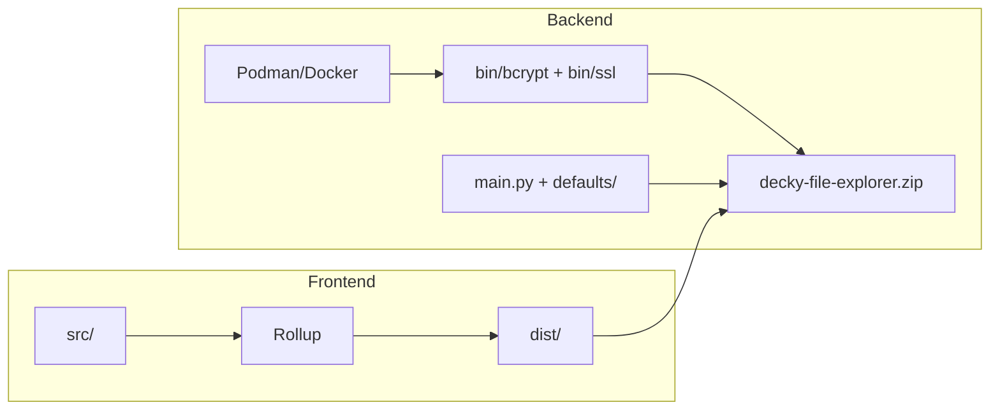

# Build & Development Guide

This document covers how to run tests, build the plugin package, and access logs when developing **decky-file-explorer**.

## Overview

The project has three main parts:

- **Frontend** — TypeScript/React, bundled with Rollup via `@decky/rollup` (`rollup.config.js` → `dist/`)
- **Backend** — Python (`main.py` + `defaults/py_modules/`), with native dependencies in `bin/` (bcrypt, SSL certs)
- **Packaging** — `decky-file-explorer.zip` produced by `scripts/build-plugin.sh`



## Prerequisites

| Tool | Used for | Notes |
|------|----------|-------|
| **Python 3.13+** | Tests | `.python-version` pins `3.13.1` |
| **pnpm** | Frontend build | Required by `package.json` |
| **Node.js** | Frontend build | Implicit via pnpm |
| **Podman or Docker** | Full build only | Podman preferred when both are installed (`scripts/build-plugin.sh`) |
| **zip / zipinfo** | Packaging | e.g. `sudo pacman -S zip` on Arch |

For manual Python setup, `scripts/dependencies.txt` lists minimal pip installs:

```bash
pip install -e .          # plugin runtime
pip install -e ".[test]"  # tests
```

## Running Tests

From the project root:

```bash
pnpm test
```

This is equivalent to:

```bash
bash scripts/run-tests.sh
```

The test runner (`scripts/run-tests.sh`) automatically:

1. Creates or repairs a `.venv` at the project root
2. Installs the editable package with test extras: `pip install -e ".[test]"`
3. Runs `pytest` using config from `pyproject.toml` (`testpaths = ["tests"]`, `asyncio_mode = "auto"`)

### Useful variants

```bash
# Force reinstall of test dependencies
bash scripts/run-tests.sh --install

# Pass pytest args through
bash scripts/run-tests.sh tests/test_server.py -v
bash scripts/run-tests.sh -k "test_log"
bash scripts/run-tests.sh --cov=defaults/py_modules
```

### Manual setup

```bash
python3 -m venv .venv
source .venv/bin/activate
pip install -e ".[test]"
pytest
```

### Test suite

The `tests/` directory contains 11 test modules covering the server, handlers, security, filesystem, zip, streaming, game recording, and the main plugin API.

## Building

### Full release build (recommended)

```bash
bash scripts/build-plugin.sh
```

The script performs these steps:

1. **Backend** (if `backend/` exists) — builds a Podman/Docker image from `backend/Dockerfile`, runs `backend/entrypoint.sh` to produce `backend/out/bcrypt` and `backend/out/ssl`, then copies bcrypt → `bin/` and SSL → `bin/ssl`
2. **Frontend** — runs `pnpm install` (if needed) and `pnpm run build` (Rollup → `dist/`)
3. **Package** — stages files and directories, then creates `decky-file-explorer.zip` at the project root

The script validates that `dist/` exists and prints the zip size and file count on success.

> **Note:** `scripts/build-plugin.py` is a lighter alternative that runs `pnpm build` and creates the zip without the bcrypt/SSL container build. Use it for frontend-only packaging; the shell script is the canonical full build.

### Frontend-only build

For faster UI iteration without rebuilding native dependencies:

```bash
pnpm install
pnpm run build   # one-shot
pnpm run watch   # watch mode during UI work
```

This produces `dist/index.js` (and related assets) without touching `bin/`.

### Build artifacts

| Path | Description |
|------|-------------|
| `dist/` | Compiled frontend (gitignored) |
| `bin/bcrypt/` | Prebuilt bcrypt module for the Steam Deck target |
| `bin/ssl/` | Self-signed cert/key for HTTPS |
| `decky-file-explorer.zip` | Installable plugin package |

## Obtaining Logs

### Local development

The repo includes a mock Decky environment in `decky/` for coding without a Steam Deck. Logging is configured in `decky/decky.py`:

| Setting | Value |
|---------|-------|
| **Directory** | `.deckyloader-mock-env/.decky_log/` (gitignored) |
| **Files** | Timestamped, e.g. `2026-08-28 12.14.30.log` |
| **Console** | Logs also go to stdout |
| **Log level** | `DECKY_LOG_LEVEL` env var (`INFO` default; also `DEBUG`, `WARNING`, `ERROR`, `CRITICAL`) |

Run the backend server locally:

```bash
source .venv/bin/activate   # after pip install -e .
DECKY_LOG_LEVEL=DEBUG python dev_run.py
```

Python code uses `decky.logger` throughout (`main.py`, `defaults/py_modules/server.py`). The frontend can forward messages via `logInfo` / `logError` RPC (`src/utils/ServerAPI.ts`).

### On Steam Deck (production)

Per [Deckbrew environment variables](https://wiki.deckbrew.xyz/plugin-dev/env-vars) and the plugin name in `plugin.json` (`"name": "DeckyFileExplorer"`):

| Setting | Value |
|---------|-------|
| **Log directory** | `/home/deck/homebrew/logs/DeckyFileExplorer/` |
| **Main log file** | `plugin.log` (via Decky's `DECKY_PLUGIN_LOG`) |

```bash
# On the Deck (Desktop Mode terminal)
tail -f ~/homebrew/logs/DeckyFileExplorer/plugin.log
```

Other ways to view logs:

- **Decky UI** — enable Developer Mode in Decky settings, then use the built-in log viewer
- **Loader service logs** — `journalctl | grep PluginLoader` (for loader-level issues, not plugin Python logs)
- **Restart after install** — `sudo systemctl restart plugin_loader`

### What gets logged

- Plugin lifecycle (`_main`, `_unload`, `_uninstall`)
- Web server start/stop and credential/login warnings
- Settings changes
- JavaScript errors forwarded from the frontend via `logError`

## Troubleshooting

| Problem | Likely fix |
|---------|------------|
| `pnpm not found` | Install pnpm globally |
| `Podman or Docker not found` | Install and start Podman or Docker; the build script exits if neither is available |
| `dist/ folder not found` | Run `pnpm run build` before packaging |
| Broken `.venv` | `rm -rf .venv && bash scripts/run-tests.sh` |
| Backend build permission issues | The build script may use `sudo` for SSL copy/cleanup on some systems |
